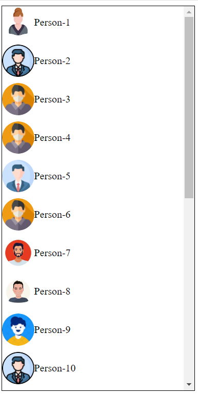
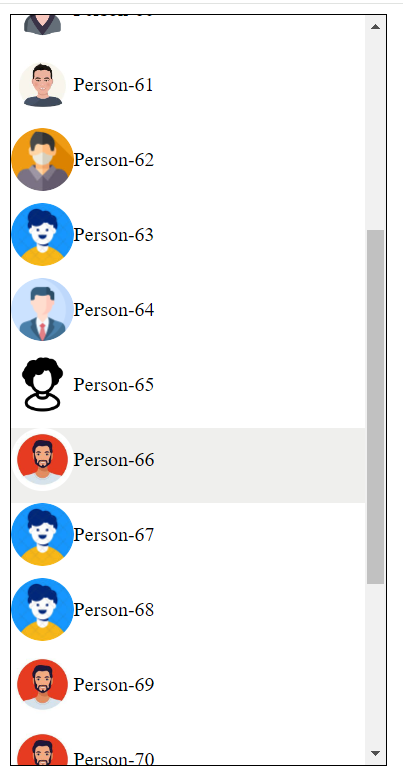

# Infinite Scrollable Contacts 🚀

This project implements an infinite scrollable contacts list using jQuery. It dynamically loads and removes contacts as you scroll, providing a seamless user experience.

## Screenshots 📸


*Initial Contacts*


*Scrolling to Load More Contacts*

## Project Structure 🏗️

- **index.html**: The main HTML file containing the structure of the web page.
- **script.js**: jQuery script orchestrating the infinite scrollable contacts list.
- **style.css**: CSS file defining the styles for the contacts list.
- **images**: Folder containing demo images for contact avatars.

## Getting Started 🚀

1. **Download the Repository:**
   - Click the green "Code" button on the repository page.
   - Choose "Download ZIP" to download the entire repository.

2. **Extract the ZIP file:**
   - Once the download is complete, extract the contents of the ZIP file to your desired location.

3. **Open in a Web Browser:**
   - Navigate to the extracted folder and open `index.html` in your preferred web browser.

4. **Start Scrolling:**
   - Experience the magic of the Infinite Scrollable Contacts by scrolling through the list.

## jQuery Plugin ⚙️

This project uses a custom jQuery plugin (`script.js`) to create the infinite scrollable contacts list. The plugin allows for easy customization of the total number of contacts and the starting contact ID.

## Customization 🛠️

You can customize the behavior of the contact list by modifying the options in the `script.js` file. The available options include the total number of contacts (`totalContacts`) and the starting contact ID (`contactid`).

```javascript
$(document).ready(function () {
    $("#contacts").infiniteScrollContacts({
        totalContacts: 100,
        contactid: 10
    });
});
```

## Infinite Scroll Enchantment ✨

Dynamically creates contact elements with captivating images and text.
An initial burst of 20 contacts welcomes your users.
As they scroll down, more contacts gracefully join the party, while the earlier ones gracefully exit, creating an infinite scroll spectacle.
Impeccable detection of scroll direction orchestrates the ballet of contact additions and retirements.

## Options Magic 🎩✨

Behold the plugin's flexibility with these enchanting options:

- `totalContacts`: The grand total of contacts ready to dazzle the screen initially. Defaults to 50.
- `contactid`: The starting ID for your contacts, setting the tone for the show. Defaults to 1.

## License 📜

This project is licensed under the [MIT License](./LICENSE) - see the [LICENSE](./LICENSE) file for details.


